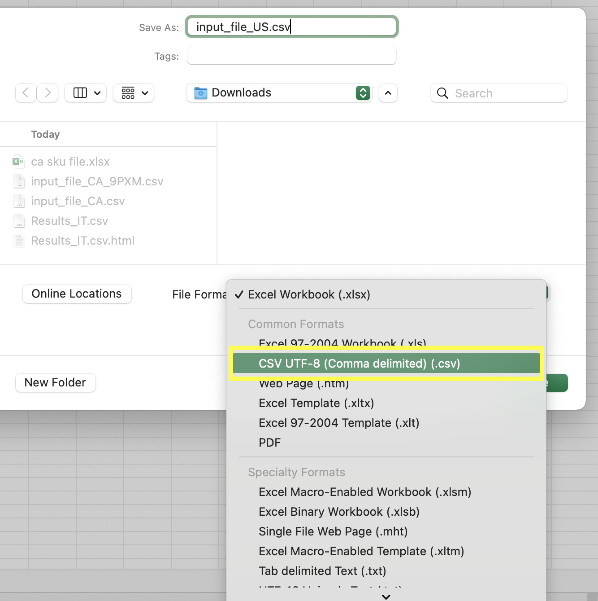

<p align="center">
  <a href="#book-project-description">Description</a>
  ::
  <a href="#rocket-installation-steps">Installation</a>
  ::
  <a href="#page_facing_up-passing-input-files">Input Files</a>
  ::
  <a href="#pushpin-key-points-and-recommendations">Key Points</a>
  ::
  <a href="#warning-known-issues">Known Issues</a>
  ::
  <a href="#thought_balloon-future-scope">Future Scope</a>
  ::
  <a href="#sparkles-contributors">Contributors</a>
    ::
  <a href="#email-support">Support</a>
</p>
  
:book: Project Description
---
The goal of this project is to scrape price data of products based on their unique SKU numbers from a set of websites. There are 4 python scripts in total.

* ***sku_US.py*** : This script is for scraping the price from  www.cdw.com.

* ***sku_CA.py***: This script is for scraping price from www.cdw.ca. Note that this script does not cover 9PXM Tower and 9PXM Rackmount categories. So, you can remove those 2 categories of SKUs from the input SKU file.

* ***sku_CA_9PXM.py*** : This script is for scraping prices from www.cdw.ca, www.pc-canada.com, and www.cendirect.com. The lowest price found in these 3 sites is updated as the ‘price’ corresponding to the SKU. You can remove all the other categories of SKUs from this input SKU file.

* ***sku_IT.py***: This script is for scraping the price from www.ingrammicro.com. You need to have the login credentials locally stored in a file named ‘IT_creds.py’


:rocket: Installation Steps
---
1. Save the input sku files in ```UTF-8 enabled``` csv format. Skipping this step will lead to errors during script execution. 
<br> ```File -> Save As -> CSV UTF-8(.csv)```</br>

<p align="center"></p>

2. Clone the Github repository to a desired location on your computer. You will need [git](https://git-scm.com/) to be preinstalled on your machine. Once the repository is cloned, you will then ```cd``` into the local repository.
```
git clone https://github.com/srujanarao/Price-Scraping.git
cd Price-Scraping
```
3. This project uses Python 3, so make sure that [Python](https://www.python.org/downloads/) and [Pip](https://pip.pypa.io/en/stable/installation/) are preinstalled. All requirements of the project are listed in the ```requirements.txt``` file. Use pip to install all of those. pip3 is an updated version of pip which is used basically for python 3+
```
pip3 install -r requirements.txt
```
4. In order to run ```sku_IT.py```, you need to have the vendor portal's login credentials saved in a local file named ```IT_creds.py``` in the following format. Follow the same naming convention and replace 'username' and 'password' with the correct credentials.

<p align="center"></p>

5. ***Install Google Chrome Browser***:  ```sku_CA_9PXM.py``` and ```sku_IT.py``` scripts need Google Chrome browser for their execution. As a result, a chrome browser instance will automatically launch when the scripts are run. Note that the variable ```headless=True``` should not be changed to False. Otherwise the scripts are most likely to fail browser checks resulting in incorrect results.

5. Once all the requirements are installed, you will have to ```cd``` into the ```src``` folder. Once in the ```src``` folder, use the python3 command to run the ```.py``` scripts along with the name of the appropriate input file. python command can be allowed to point to Python 3 too.
```
cd src
python3 sku_US.py input_file_US.csv
```

:page_facing_up: Passing Input Files
---
#### 1. Command Line Arguments
The first way of passing an input file to the script is through ```command line arguments```. Ensure that the input files are saved in the same folder as the .py scripts. 
```
python3 sku_CA.py input_file_CA.csv
```
#### 2. Setting IDE script parameters
You can also make us of ```Script Parameters``` of an IDE like PyCharm to automatically submit the input file.
```
Edit Configurations -> Fill '-s' in 'Interpreter Options' and "input_file_name.csv" in 'Parameters'
```

<p align="center"></p>

<p align="center"></p>

:pushpin: Key Points and Recommendations
---
#### 1. Bypassing Cloudflare
www.pc-canada.com is secured by ```Cloudflare``` , a company that provides security services to websites to verify that the request is made by a real browser and not by a bot/script. So, ```sku_CA_9PXM.py``` script makes use of 'undetected-chromedriver', an optimized Selenium Chromedriver patch to bypass Cloudflare by posing as a real browser. However, we do not recommend  using the script to bypass the browser check in a long run.

#### 2. CSV Results
Note that each time a script is run a new csv output file is generated and the names are distinguishable by ```time stamps```. So, file contents are not overwritten and hence old logs need to be manually deleted if needed. Some examples of sample output files are attached below.

* ***Results_US_.csv***
<p align="center"></p>

* ***Results_CA_.csv***
<p align="center"></p>

* ***Results_CA_9PXM.csv***
<p align="center"></p>

* ***Results_IT.csv***
<p align="center"></p>

:warning: Known Issues
---
####  Unstable Search Results
It is observed that www.cendirect.com some times displays irrelevant results upon entering SKU in the search bar. Home page contents get displayed rather than a redirection to the relevant product results. This is an ```intermittent website issue``` and usually gets resolved after a couple of hours. So, attempt to rerun the ```sku_CA_9PXM.py``` script after a few hours. Whenever this issue occurs, the script is written in a way to print and log the below message. 

<p align="center"></p>

:thought_balloon: Future Scope
---
1. More efficient ways to handle 'Access Denied' issues without compromising on run time. Currently implemented using ```headers, usergants and requests.Session()```
2. More ways to handle intermittent inconsistent search results in www.cendirect.com

:sparkles: Contributors
---
- Rakesh Ravi
- Srujana Shiva Rao
- Landon Smith

:email: Support
---

For any queries and help, please reach out to us at: rravi@ncsu.edu, smarnes@ncsu.edu, lgsmith9@ncsu.edu

